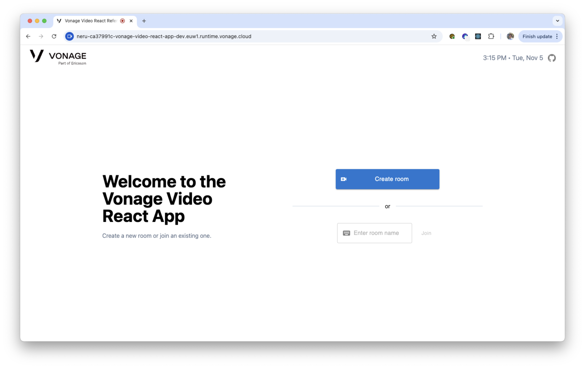
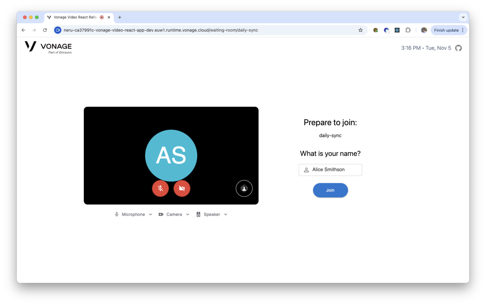
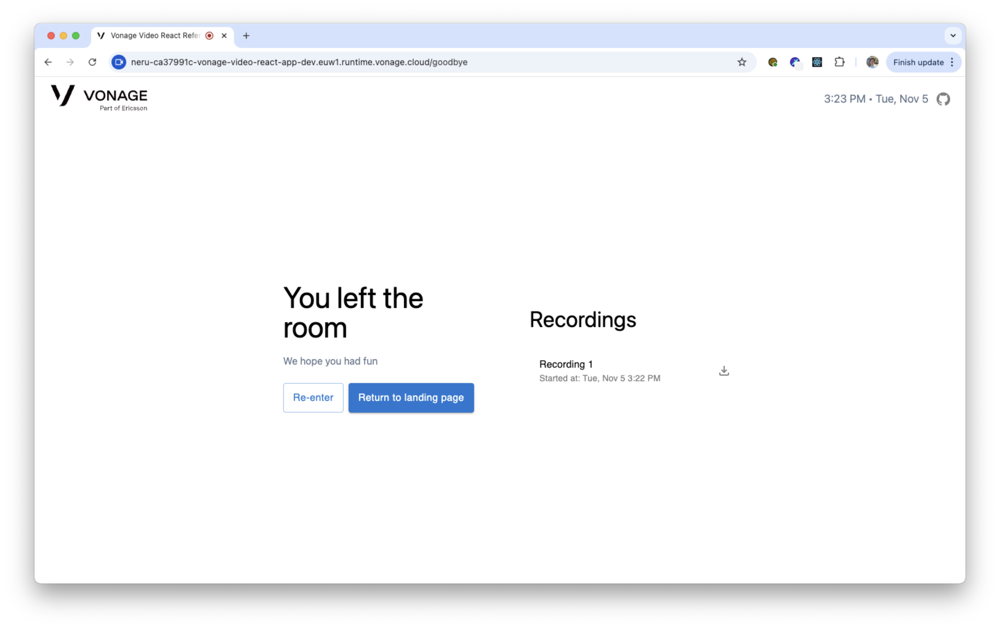
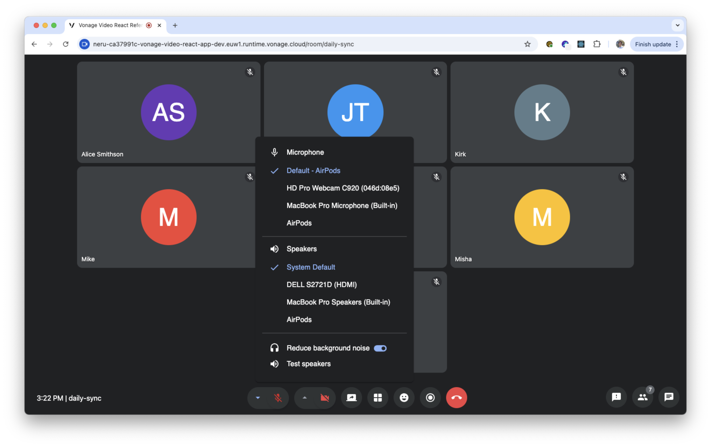
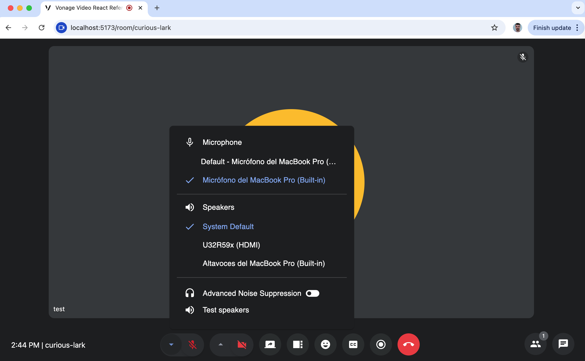
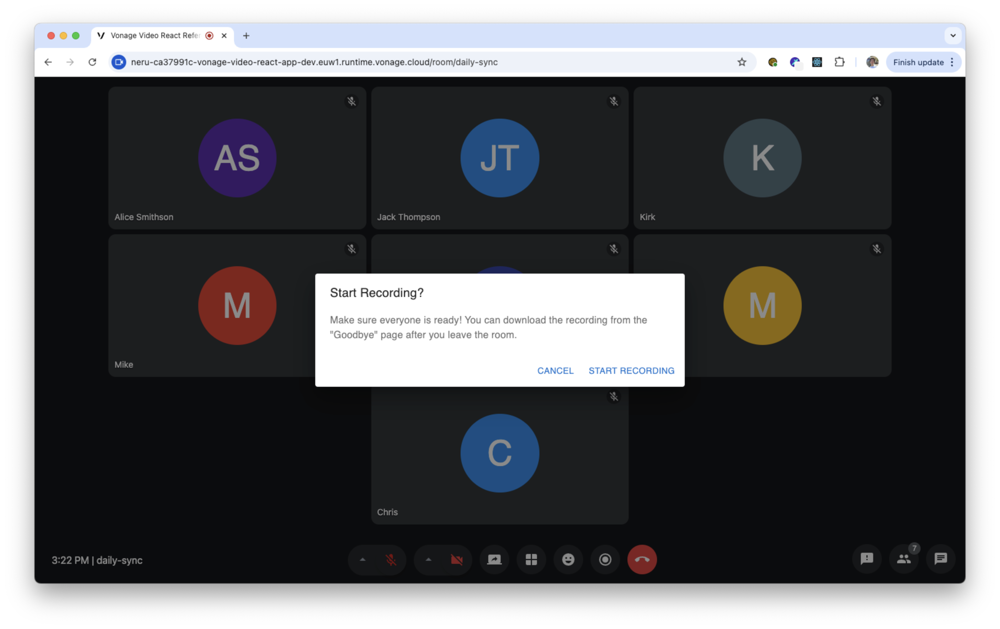
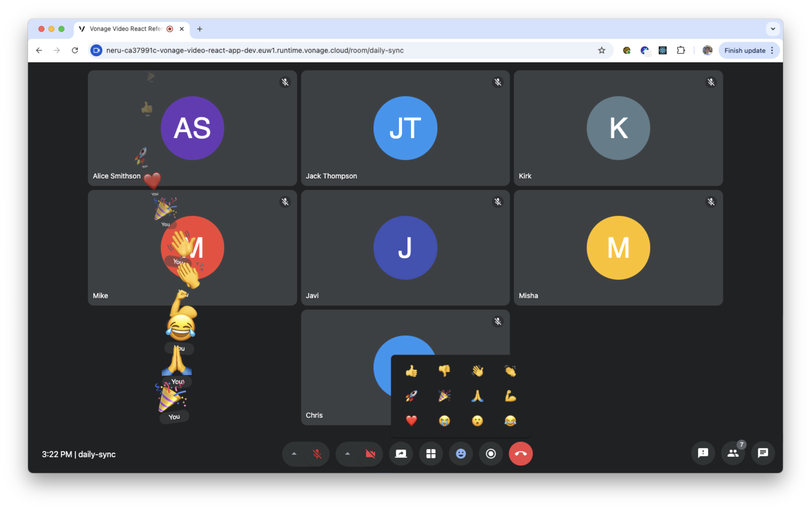
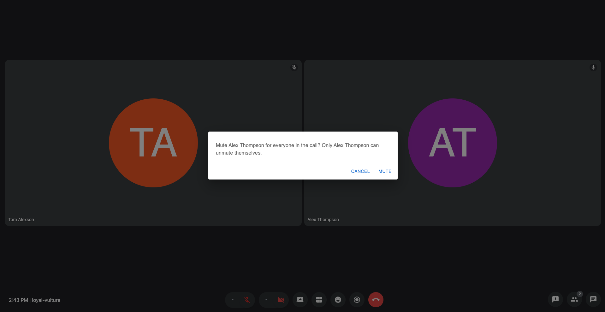
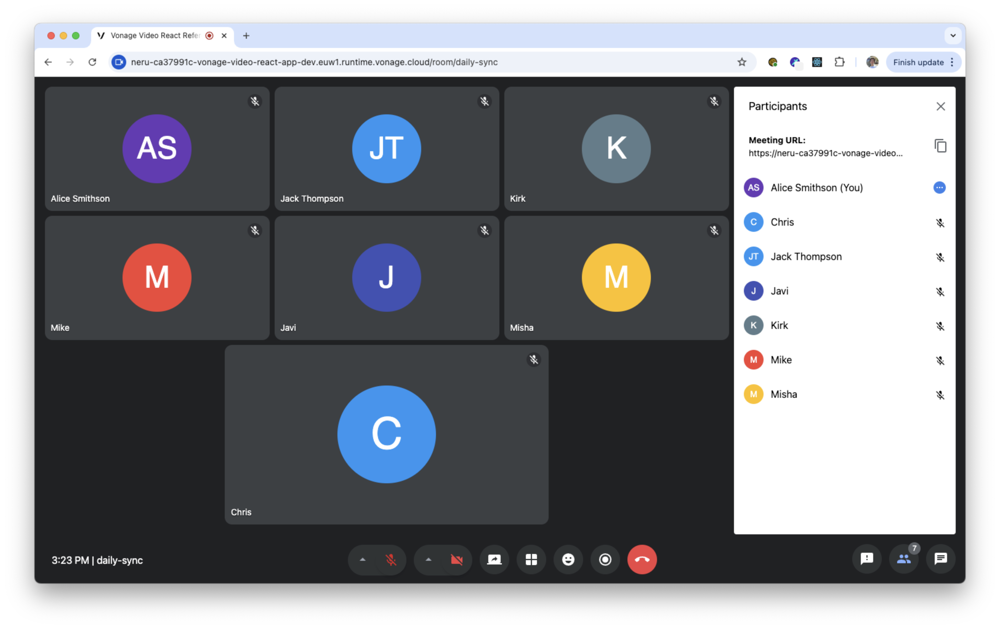
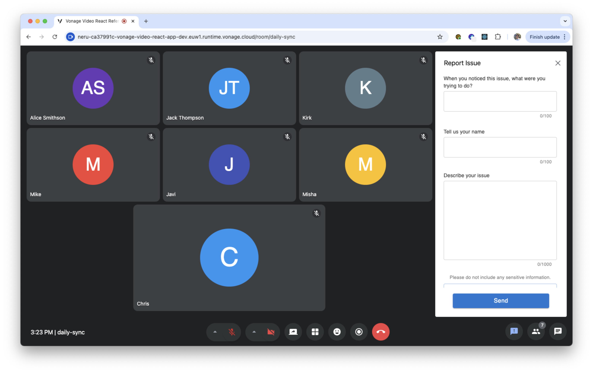

# Vonage Video API Reference App for React

An open-source video conferencing reference application for the [Vonage Video API](https://developer.vonage.com/en/video/client-sdks/web/overview) using the React framework. It demonstrates best practices for integrating video calling, recording, screen sharing, reactions, and more into your application.

## Cross-Platform Support

The Vonage Video API Reference App is also available for other platforms:

- **iOS**: [vonage-video-ios-app](https://github.com/Vonage/vonage-video-ios-app)
- **Android**: [vonage-video-android-app](https://github.com/Vonage/vonage-video-android-app)

These reference apps share the same backend infrastructure and demonstrate consistent best practices across all platforms.

## SDK Compatibility & Requirements

| Category | Details |
|----------|---------|
|  Chrome | Latest release |
|  Firefox | Latest release |
|  Edge | Latest release |
|  Opera | Latest release |
|  Safari | Latest release |
| Minimum device width | 360px |
| Media Processors | Chromium-based browsers only (see [OT.hasMediaProcessorSupport](https://vonage.github.io/video-docs/video-js-reference/latest/OT.html#hasMediaProcessorSupport)) |
| Node.js | v22 |
| Package manager | [yarn](https://yarnpkg.com) |
| Version manager (optional) | [nvm](https://github.com/creationix/nvm) |

## Features

This application provides features for common conferencing use cases, such as:

- 

    
A landing page for users to create and join meeting rooms.

    
  

- 

    
A waiting room for users to preview their audio and video device settings and set their name before entering a meeting room.

    
  

- 

    
A post-call page to navigate users to the landing page, re-enter the left room, and display archive(s), if any.

    
  

- A video conferencing "room" supporting up to 25 participants and the following features:
- 

    
Input and output device selectors.

    
  

- 

    
Noise suppression toggles in meeting room

    
  

- 

    

      Video effects in meeting and waiting room. You can set predefined images, custom image or slight/strong background blur. Images can be uploaded from local device or URL in these formats: JPG, PNG, GIF or BMP. Video effects are not supported in non-Chromium-based browsers or on iOS.
      
    Please see [OT.hasMediaProcessorSupport](https://vonage.github.io/video-docs/video-js-reference/latest/OT.html#hasMediaProcessorSupport) for more information.
    

  
    
  

- 

    
Composed archiving capabilities to record your meetings.

    
  

- 

    
In-call tools such as screen sharing (subscriber can zoom in/out if hasMediaProcessorSupport), group chat function, and emoji reactions.

    
  

- Active speaker detection.
- Layout manager with options to display active speaker, screen share, or all participants in a grid view.
- The dynamic display adjusts to show new joiners, hide video tiles to conserve bandwidth, and show the "next" participant when someone previously speaking leaves.
- 

    
Ability to mute other participants during the meeting.

    
  

- 

    
Call participant list with audio on/off indicator.

    
  

- Meeting information with an easy-to-share URL to join the meeting.
- 

    
A reporting tool to enable participants to file any in-call issues.

    
  

  - 

 
Advanced settings panel available in both the waiting room and meeting room, allowing fine-grained control over video, audio and metrics

 

## Documentation

| Document | Description |
|----------|-------------|
| [Getting Started](./docs/GETTING_STARTED.md) | Environment setup, local development, and deployment guide |
| [Architecture](./docs/ARCHITECTURE.md) | Nx workspace structure, projects, and library boundaries |
| [Configuration](./docs/CONFIGURATION.md) | Environment variables, feature flags, theming, and Storybook |
| [Testing](./docs/TESTING.md) | Integration tests, screenshot tests, and unit test suites |
| [Code Style](./docs/CODE_STYLE.md) | Linting, formatting, naming conventions, and doc generation |
| [Contributing](./docs/CONTRIBUTING.md) | How to contribute to the project |
| [Known Issues](./docs/KNOWN_ISSUES.md) | Tracked known issues and workarounds |
| [Dependencies](./docs/DEPENDENCIES.md) | Third-party dependency information |

## Contributing

We welcome contributions from the community. Please read our [Contributing guide](./docs/CONTRIBUTING.md) for details on how to get involved.

## Support / Getting Help

If you need help or have questions, reach out to [support@api.vonage.com](mailto:support@api.vonage.com).

## Code of Conduct

Please read our [Code of Conduct](CODE_OF_CONDUCT.md).

## Maintainers

This repository is actively maintained by the Vonage Video team. See [MAINTAINERS.md](./MAINTAINERS.md) for details.

## Report Issues

If you encounter any issues, [open a GitHub issue](https://github.com/Vonage/vonage-video-react-app/issues) or reach out to [support@api.vonage.com](mailto:support@api.vonage.com).
