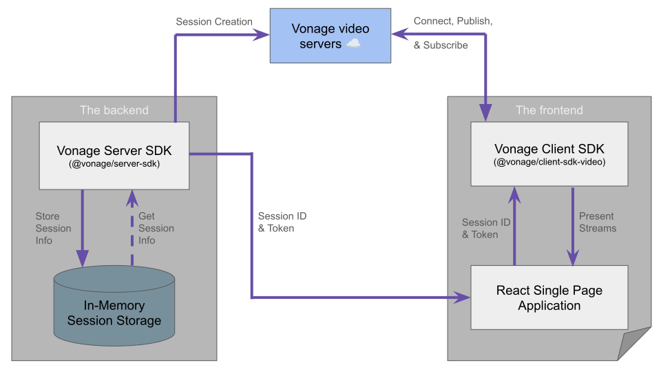

# Project Architecture

The Vonage Video API Reference App for React uses an [Nx](https://nx.dev/) monorepo to organise its codebase into independently buildable projects and shared libraries. This document describes the workspace structure, each project and library, and the rules that govern where code belongs.

## Architecture Diagram



## Nx Workspace Overview

The repository is structured as an Nx workspace with three deployable projects and four shared libraries. Nx manages build orchestration, dependency graphing, and caching across all packages.

```
/
├── frontend/          # React web application
├── backend/           # Node.js/Express API server
├── integration-test/  # Playwright test suite
└── libs/
    ├── ui/            # Reusable visual React components
    ├── core/          # Non-visual React logic and hooks
    ├── common/        # Shared utilities and helpers
    └── api/           # Vonage Video API orchestration
```

## Projects

| Project | Description |
|---------|-------------|
| `frontend` | React-based video conferencing web application — the main user-facing app providing the meeting room UI, waiting room, and all participant-facing features. |
| `backend` | Node.js/Express server providing REST API endpoints for video session creation, token generation, archiving, and other server-side Vonage Video API operations. |
| `integration-test` | Playwright-based integration and screenshot test suite that validates end-to-end user flows and visual consistency across browsers. |

## Libraries

| Library | Description |
|---------|-------------|
| `libs/ui` | Reusable, stateless visual React components (buttons, dialogs, layout primitives) that are generic and agnostic of any specific screen or application logic. |
| `libs/core` | Faceless (non-visual) React logic, hooks, and utilities for video functionality — provides the building blocks for managing publishers, subscribers, sessions, and media without rendering UI. |
| `libs/common` | Shared helpers, utilities, and hooks that are agnostic of any specific project — usable by the frontend, backend, or other libraries without introducing domain-specific coupling. |
| `libs/api` | Backend-agnostic Vonage Video API handler and orchestration logic — encapsulates direct API interactions so consuming code does not need to manage low-level API details. |

## Module Boundaries

The following rules determine where code belongs within the workspace:

| Code Type | Belongs In | Rationale |
|-----------|-----------|-----------|
| Generic, stateless visual components | `libs/ui` | Reusable across any screen or app; no business logic. |
| Non-visual logic, hooks, and utilities for video | `libs/core` | Separates behaviour from presentation; enables reuse without UI coupling. |
| Shared utilities, helpers, and hooks agnostic of domain | `libs/common` | Cross-cutting concerns usable by any project or library. |
| Vonage Video API orchestration and handler logic | `libs/api` | Isolates API interaction details from application-level code. |
| App-specific business logic (roles, permissions, product decisions) | `frontend` / `backend` | Domain-specific logic that is not reusable outside the application layer. |

### Key Principles

- **Libraries are generic** — they must not contain logic tied to a specific screen, user role, or product decision.
- **Projects own business logic** — the `frontend` and `backend` projects compose library primitives with app-specific rules.
- **Dependency direction flows inward** — projects depend on libraries, but libraries must not depend on projects. Libraries may depend on other libraries (e.g., `libs/core` can use `libs/common`).
- **Single responsibility** — each library has a clear, non-overlapping purpose. If new code could fit in multiple libraries, prefer the most specific one (e.g., a video-related hook goes in `libs/core`, not `libs/common`).

## Related Documentation

- [Getting Started](./GETTING_STARTED.md) — environment setup and local development
- [Configuration](./CONFIGURATION.md) — environment variables, feature flags, and theming
- [Back to README](../README.md)
