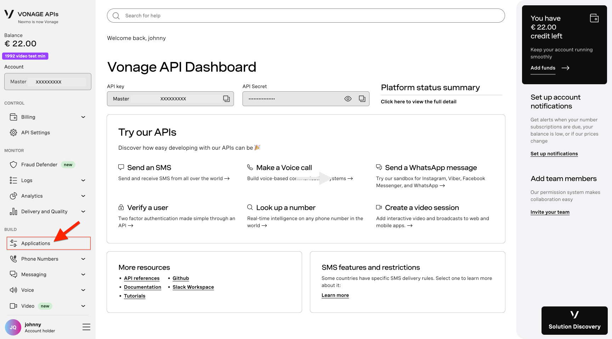
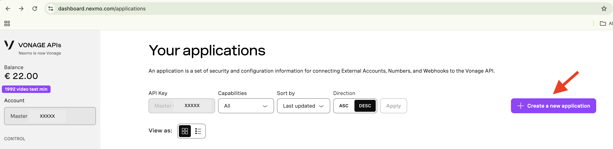
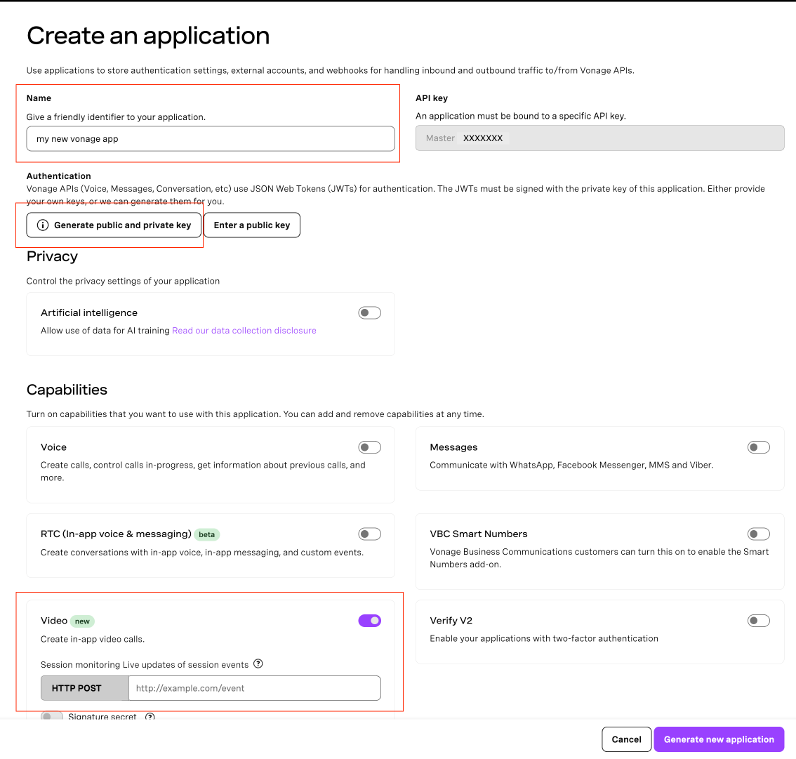
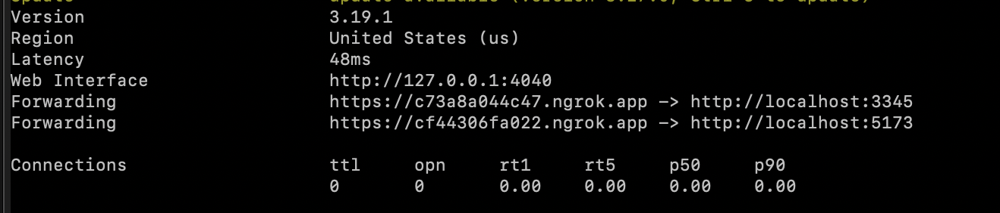

# Getting Started

This guide covers environment setup, running the application locally, testing across multiple devices, and deploying to Vonage Cloud Runtime.

> For the full list of environment variables and feature flags, see [Configuration](./CONFIGURATION.md).
> For an overview of the project structure, see [Architecture](./ARCHITECTURE.md).
> To return to the main README, see [README](../README.md).

## Running Locally

### Ensure You Have a Vonage Account

You can create one at the [Vonage API Dashboard](https://dashboard.vonage.com/applications).

### Create an Application in the Dashboard

Once logged in, navigate to the [Applications page](https://dashboard.vonage.com/applications) via the main dashboard menu:

<details close>
<summary>Applications dashboard view</summary>

</details>

If you don't already have an application, create a new one:

<details close>
<summary>Create new app</summary>

</details>

During the setup process, make sure to:

- Provide a name for your application.
- Generate and download the public and private keys.
- Enable **Video** capabilities.

Refer to the following image for visual guidance:

<details close>
<summary>Configuring a new app</summary>

</details>

### Environment Variables

In the root project directory, create the backend environment file by running:

```bash
cp backend/.env.example backend/.env
```

Then, open **backend/.env** and fill in the required configuration:

- **VONAGE_APP_ID** – This is the ID of your Vonage application. You can find it on the [Applications page](https://dashboard.vonage.com/applications).
- **VONAGE_PRIVATE_KEY** – If you've already generated a private key, use that. Otherwise, use the key you downloaded when creating the app.

Frontend feature flags and display settings are configured in [`env.sh`](../env.sh). The defaults work out of the box — edit that file only when you need to customise behaviour. See [Configuration](./CONFIGURATION.md) for the full list of available options.

### Start in Development Mode

```bash
yarn dev
```

This starts both the backend server (port **3345**) and the frontend Vite dev server (port **5173**). You can now access the app at [http://localhost:5173](http://localhost:5173).

---

## Testing on Multiple Devices

To test the video API across multiple devices on your local network, you can use **ngrok** to expose your frontend and backend publicly.

1. Create an account at [ngrok](https://dashboard.ngrok.com/signup) if you haven't already.

2. Follow the [Setup and Installation instructions](https://dashboard.ngrok.com/get-started/setup/) for your operating system to install and configure ngrok.

3. **Start the application locally first:**

    ```bash
    yarn dev
    ```

    Make sure both the backend server (port 3345) and frontend dev server (port 5173) are running before proceeding to the next step.

4. **Create secure tunnels for both frontend and backend:**

    **Set up ngrok configuration:**

    First, find your ngrok config file location:
    ```bash
    ngrok config check
    ```

    Create or edit the ngrok configuration file (typically located at `~/Library/Application Support/ngrok/ngrok.yml` on macOS; `~/.config/ngrok/ngrok.yml` on Linux and `%HOMEPATH%\AppData\Local\ngrok\ngrok.yml` on Windows) with the following content:

    ```yaml
    version: "2"
    tunnels:
      frontend:
        addr: 5173
        proto: http
      backend:
        addr: 3345
        proto: http
    ```

    **Start both tunnels:**
    ```bash
    ngrok start backend frontend
    ```

    This command will create publicly accessible HTTPS URLs for both your frontend and backend. The output will appear in your terminal, similar to the image below:

    <details close>
    <summary>ngrok output example</summary>
    
    </details>

5. **Copy the domains** from both outputs and update [`env.sh`](../env.sh):

    ```bash
    export TUNNEL_DOMAIN=your-frontend-domain.ngrok.io
    export API_URL=https://your-backend-domain.ngrok.io
    ```

    **Note:** ngrok assigns temporary domains. You'll need to update these values each time the domains change.

6. **Open the provided frontend Forwarding URL** in your browser. This exposes your entire application publicly, allowing devices on any network to access it.

Enjoy testing!

---

## Storybook

Storybook is available for developing and testing UI components in isolation.

To run Storybook for the frontend:

```bash
yarn storybook frontend
```

This will start the Storybook dev server at [http://localhost:6006](http://localhost:6006).

---

To run Storybook for the UI library:

```bash
yarn storybook ui
```

This will start the Storybook dev server at [http://localhost:6007](http://localhost:6007).

---

## Deployment to Vonage Cloud Runtime

You can deploy the application to Vonage Cloud Runtime (VCR) for testing in a cloud environment. See the [VCR overview](https://developer.vonage.com/en/vonage-cloud-runtime/overview) for more information.

For quick development deployments directly from your local machine, you can use the `vcr:dev` script:

### 1. Install the VCR CLI

If not already installed, follow the installation instructions at https://developer.vonage.com/en/vonage-cloud-runtime/getting-started/working-locally#cli-installation

### 2. Configure VCR with your credentials

```bash
vcr configure
```

Enter your Vonage API Key and Secret, and select a region.

### 3. Generate application keys

```bash
vcr app generate-keys --app-id <app-id> --region <region>
```

Replace `<app-id>` with your Vonage application ID and `<region>` with your region.

> ⚠️ **Warning**: You should use a **separate** Vonage application for VCR deployment (different from the `VONAGE_APP_ID` in your `backend/.env` file) to avoid issues with your private key.

### 4. Set up your development configuration

Copy the development configuration example file:

```bash
cp vcr.yml.example vcr-dev.yml
```

Open `vcr-dev.yml` and add your application ID.

### 5. Deploy to development

```bash
yarn vcr:dev
```

This will deploy using your local development configuration and code, making it quick to test changes in a cloud environment.
